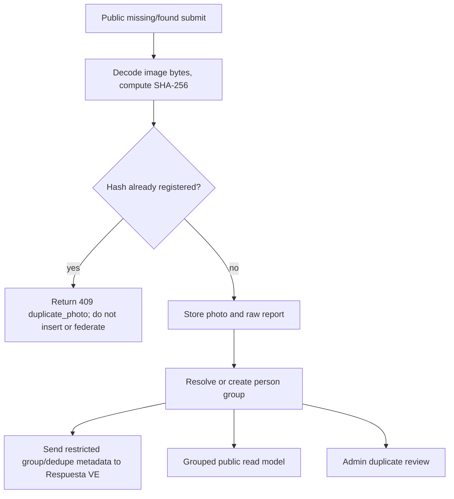
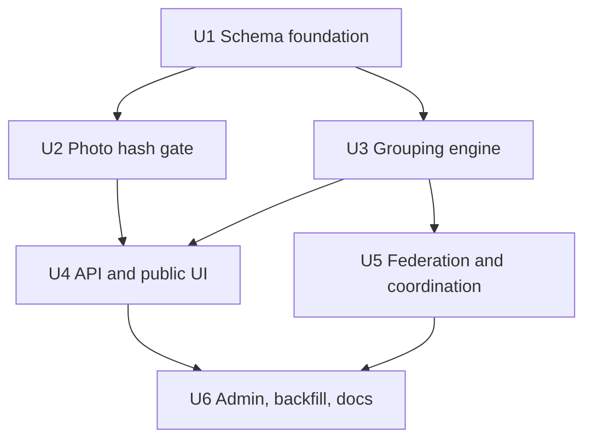
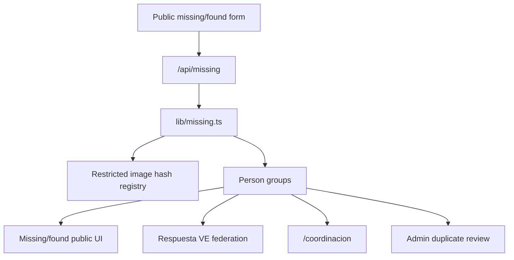

# feat: Add person dedupe and grouping

## Overview

PR #17 currently forwards dedupe hints to Respuesta VE, but local person records
are still inserted one-by-one and rendered as independent cards. This plan turns
that PR into an actual local dedupe/grouping implementation for missing/found
people:

| Signal | Behavior |
| --- | --- |
| Exact uploaded image bytes already seen | Reject the new public record before it is stored or federated. |
| Same cédula-like identity signal, when available | Group records with high confidence without exposing the raw document number. |
| Same normalized name with compatible age/status/location evidence | Keep every report, attach it to a reviewable group, and show one public grouped card. |
| Conflicting active/found reports inside a group | Preserve the group and show a verification warning, not an automatic closure. |

The grouped UI should match the screenshot's intent: one person-facing card,
badges such as "Mismo registro · N reportes", source rows under the canonical
summary, and a warning when one source says found while another remains active.

### Implementation Note

Implemented in this PR with additive Drizzle schema, exact SHA-256 image hash
gating, deterministic non-destructive groups, grouped public reads via
`GET /api/missing?grouped=1`, advisory federation metadata, coordination grouped
nodes, admin metrics, and an idempotent backfill script. Public cédula capture,
perceptual image matching, and maintainer override flows remain deferred.

---

## Problem Frame

In a humanitarian missing-person directory, duplicate records create noise for
families and operators. However, destructive merges are risky: similar names can
be different people, reported ages can be guessed, and status updates can
conflict across sources. The repo already documents the safe posture in
`docs/rfcs/0001-sincronizacion-fuentes.md`: group probable matches without
deleting raw reports. Existing code has a read-only duplicate report in
`lib/sync/dedup.ts`, idempotent external upsert by `(source, external_id)` in
`lib/missing.ts`, and federation metadata in `lib/federation.ts`, but it lacks a
write-time duplicate gate and a public grouped read model.

---

## Requirements Trace

- R1. Exact duplicate uploaded photos must be detected by a server-computed hash
  before storage; a repeated image disqualifies the new public record.
- R2. Image hashes and identity-document hashes are restricted operational
  metadata and must never appear in public API responses, docs examples, logs, or
  client bundles.
- R3. Same-person grouping must be non-destructive: raw `missing_persons` rows
  remain addressable, source provenance is preserved, and false positives can be
  reviewed.
- R4. Grouping must prioritize strong identity signals: cédula/document hash when
  present, then exact source identity, then high-confidence name/age/location
  evidence.
- R5. Grouped public views must show one representative person card with report
  count, source rows, and conflict warnings when active/found statuses disagree.
- R6. Existing `/api/missing` clients must remain compatible unless they opt into
  grouped output.
- R7. Federation envelopes must carry restricted grouping/dedupe metadata for
  Respuesta VE without converting local groups into automatic canonical merges.
- R8. Schema work must follow Drizzle expand-contract migrations and must not
  create tables at runtime.

---

## Scope Boundaries

- This plan does not add raw cédula collection to the public missing-person form.
  If document-like values arrive from trusted feeds or restricted intake, only a
  normalized keyed hash is stored.
- This plan does not delete or overwrite existing person rows when a group is
  formed.
- This plan does not make Respuesta VE auto-merge canonical `/api/v1/persons`
  records; local grouping remains an advisory/public-presentation layer.
- This plan does not implement perceptual image matching. Only exact decoded
  image bytes are a hard duplicate gate.
- This plan does not expose phone numbers, contact text, raw uploads, photo
  hashes, or identity hashes in grouped public responses.

### Deferred to Follow-Up Work

- Admin override for rare legitimate same-photo different-person reports: create
  a separate maintainer-only workflow after the hard duplicate gate is proven.
- Perceptual duplicate detection for resized/cropped copies: evaluate separately
  because false positives can be dangerous.
- Full historical R2/CDN image backfill: start with new uploads and locally
  available base64 bytes, then decide whether a rate-limited worker should fetch
  existing CDN objects.

---

## Context & Research

### Relevant Code and Patterns

- `infra/db/schema.ts` is the Drizzle source of truth; migrations are generated
  into `infra/db/migrations/` per `docs/deploy/migraciones-de-base-de-datos.md`.
- `lib/missing.ts` owns missing-person writes, reads, external upserts, and
  status updates. `addMissing()` currently inserts a new UUID row for every
  public report.
- `lib/r2.ts` parses data URLs privately and uploads new photos to R2 under
  `images/<table>/<id>.<ext>`.
- `lib/sync/dedup.ts` already classifies likely same-person groups by normalized
  name and age concentration, but it is read-only and source-scoped.
- `app/api/sync/duplicates/route.ts` and `app/admin/AdminDashboard.tsx` already
  show duplicate analysis as a non-mutating admin report.
- `lib/federation.ts` already attaches `sourceRecordId`, `contentFingerprint`,
  `processingHints`, and `canonicalCandidates`, but marks dedupe as
  `candidate_review_not_auto_merge`.
- `app/components/MissingPersons.tsx`, `app/components/FoundPersons.tsx`, and
  `app/components/MissingPersonDetail.tsx` expect a flat `MissingPerson[]`.
- `design/DESIGN.md` requires public UI to remain clear, mobile-first, Spanish,
  and careful not to overstate verification badges.

### Institutional Learnings

- The platform memory for this repo family says `candidate_duplicate` and
  related dedupe metadata must stay advisory and review-oriented, not automatic
  canonical merges.
- Prior PR #17 work focused on auth headers, opaque receipt IDs, and
  `canonicalCandidates`; it did not implement local person dedupe.

### External References

- External research is intentionally skipped. The relevant mechanics are already
  repo-local: Drizzle migrations, SHA-256/HMAC hashing with Node `crypto`, R2
  upload flow, existing source idempotency, and existing duplicate analysis.

---

## Key Technical Decisions

- Exact-image duplicate gate before public insert: compute a SHA-256 hash over
  decoded image bytes on the server, not the data URL string, so equivalent
  base64 wrapping does not bypass the gate.
- Use a restricted image-hash registry instead of exposing hash fields through
  public DTOs: this gives one lookup surface for original photos and resolution
  proof images while keeping hashes out of responses.
- Use deterministic R2 keys for newly hashed images where practical: a hash-keyed
  object path makes concurrent duplicate uploads converge on the same object and
  reduces orphan risk when a unique DB constraint rejects the second write.
- Group, do not collapse: add group metadata and membership links while keeping
  every `missing_persons` row intact for provenance, source links, and manual
  review.
- Treat cédula-like values as restricted matching evidence only: store a keyed
  hash from a server-only secret when such a value is present from a trusted
  source, never the raw value and never a public hash.
- Preserve `/api/missing` compatibility with an opt-in grouped mode: existing
  consumers keep receiving `people`, while the UI can request grouped results
  once the new contract is documented in OpenAPI.
- Keep Respuesta VE semantics advisory: send group IDs, match signals, and
  duplicate rejection receipts as restricted context, but keep promotion under
  operator review.

---

## Open Questions

### Resolved During Planning

- Should same-name records be hard rejected? No. Existing RFC guidance and crisis
  data risk favor non-destructive grouping; only exact image duplicates are a
  hard rejection.
- Should raw cédula be stored to reproduce the screenshot? No. The UI can show
  "Cédula reportada" from a restricted hash presence flag without storing or
  exposing the number.
- Should the grouped UI replace the flat API immediately? No. Use an opt-in
  grouped query or dedicated grouped endpoint to avoid breaking existing clients.

### Deferred to Implementation

- Final table/column names: choose names that match Drizzle conventions while
  preserving the shape described here.
- Transaction shape for photo hash + person insert: verify the best Drizzle path
  across the Neon HTTP and TCP drivers during implementation.
- Backfill coverage for old R2 URLs: decide after measuring how many existing
  rows have base64 bytes versus already-migrated CDN URLs.

---

## High-Level Technical Design

> *This illustrates the intended approach and is directional guidance for
> review, not implementation specification. The implementing agent should treat
> it as context, not code to reproduce.*

---

## Implementation Units

- [x] U1. **Add restricted dedupe schema**

**Goal:** Add the persistent structures needed for exact image dedupe and
non-destructive person grouping.

**Requirements:** R1, R2, R3, R4, R8

**Dependencies:** None

**Files:**
- Modify: `infra/db/schema.ts`
- Create: `infra/db/migrations/<generated-dedupe-migration>.sql`
- Modify: `infra/db/migrations/meta/_journal.json`
- Modify: `infra/db/README.md`

**Approach:**
- Add an image-hash registry keyed by SHA-256 with purpose, owning person row,
  and timestamps. It must be restricted to server code and omitted from public
  schemas.
- Add person group metadata for representative display, group status, report
  count, identity-document-hash presence, and status-conflict state.
- Link existing/new `missing_persons` rows to groups without removing the raw
  rows. Prefer nullable/additive fields or link tables so old code keeps working
  during deploy.
- Add expand-contract indexes for lookup paths: image hash, group membership,
  `(source, external_id)`, optional identity hash, and normalized blocking keys.

**Execution note:** Start with schema and migration review before wiring request
paths, because later units depend on the exact DB shape.

**Patterns to follow:**
- `infra/db/schema.ts` existing `missing_persons`, `hub_missing_persons`, and
  per-IP dedupe table patterns.
- `docs/deploy/migraciones-de-base-de-datos.md` expand-contract migration flow.

**Test scenarios:**
- Test expectation: none for generated migration behavior directly; downstream
  units must prove the schema through write, lookup, grouping, and rejection
  tests.

**Verification:**
- The migration is additive, reversible by follow-up contract work, and does not
  require runtime `CREATE TABLE` logic.
- The generated SQL includes unique/index coverage for image hashes and group
  membership lookups.

---

- [x] U2. **Gate exact duplicate images before insert**

**Goal:** Reject public missing/found submissions that upload image bytes already
registered for another person record or resolution proof.

**Requirements:** R1, R2, R6, R8

**Dependencies:** U1

**Files:**
- Create: `lib/photo-hash.ts`
- Modify: `lib/r2.ts`
- Modify: `lib/missing.ts`
- Modify: `app/api/missing/route.ts`
- Modify: `app/api/missing/[id]/found/route.ts`
- Test: `tests/unit/photo-hash.test.ts`
- Test: `tests/unit/missing-image-dedupe.test.ts`

**Approach:**
- Extract data URL decoding into a reusable server-only helper that returns
  validated bytes, content type, extension, and SHA-256.
- Compute hashes before R2 upload and DB insert. If the hash exists, return a
  specific `409 duplicate_photo` response and do not create a new public person
  record, upload a duplicate object, or send federation intake.
- Register successful image hashes together with the person row so concurrent
  submissions cannot both publish. Use DB uniqueness as the final arbiter after
  the preflight lookup.
- Preserve current behavior when no photo is submitted. Text-only reports can
  still be grouped later by U3.
- Keep memory/demo mode best-effort with an in-memory hash registry, but make
  production persistence mandatory when `DATABASE_URL` is expected.

**Patterns to follow:**
- `lib/body.ts` centralizes bounded request parsing and error responses.
- `lib/r2.ts` hard-fails R2 upload instead of silently falling back.
- `lib/store.ts` uses explicit dedupe semantics for report confirmations.

**Test scenarios:**
- Happy path: new valid JPG data URL with unseen bytes creates a hash record and
  returns the created person.
- Happy path: the same visual uploaded with different base64 line wrapping hashes
  to the same SHA-256 and is rejected.
- Edge case: a person report without a photo bypasses image-hash lookup and can
  still be inserted/grouped.
- Error path: duplicate original photo returns `409 duplicate_photo` with no
  public hash, no existing contact data, and no federation result.
- Error path: duplicate resolution proof image on `/api/missing/[id]/found`
  returns a visible error and does not mark the report as found.
- Integration: R2 configured path uploads only after the duplicate gate passes;
  a duplicate hash does not create a second stored object.

**Verification:**
- Duplicate image submissions are disqualified consistently and visibly.
- Response bodies and logs do not expose photo hashes or matched person details.

---

- [x] U3. **Create non-destructive person grouping**

**Goal:** Attach raw person reports to stable groups that represent probable
same-person clusters without deleting or auto-closing individual reports.

**Requirements:** R3, R4, R5, R8

**Dependencies:** U1

**Files:**
- Create: `lib/person-groups.ts`
- Modify: `lib/missing.ts`
- Modify: `lib/sync/dedup.ts`
- Test: `tests/unit/person-groups.test.ts`
- Test: `tests/unit/sync-dedup.test.ts`

**Approach:**
- Normalize names with the existing accent-stripping posture, but keep display
  names from source rows for the UI.
- Resolve group membership by strongest available signal:
  identity-document hash, exact `(source, external_id)` continuity, exact image
  hash for already-accepted historical data, then name/age/area confidence.
- Reuse and extend the existing age concentration classifier for grouping
  candidates, but treat ambiguous homonyms as separate groups or manual-review
  candidates.
- Compute a group-level status from members. If both active and found statuses
  appear, mark `statusConflict=true` and keep the representative status
  conservative until reviewed.
- Store group report count and source/member summaries so the UI can render
  "Mismo registro · N reportes" without scanning the full corpus on each poll.

**Patterns to follow:**
- `lib/sync/dedup.ts` same-person versus homonym classifier.
- `lib/missing.ts` `listMissingPage()` search/pagination and external upsert
  normalization.
- `docs/rfcs/0001-sincronizacion-fuentes.md` non-destructive `person_links`
  posture.

**Test scenarios:**
- Happy path: two records with the same identity-document hash attach to one
  high-confidence group and expose only a boolean "document reported" flag.
- Happy path: three records with the same normalized name and compatible age
  concentration attach to one group with report count 3.
- Edge case: same normalized name but high age concentration ratio produces
  separate groups or an ambiguous review state, not an automatic group.
- Edge case: active and found members in the same group set the conflict flag
  and keep raw member statuses intact.
- Error path: missing DB configuration in production still fails loudly instead
  of pretending grouping succeeded.
- Integration: `upsertExternalMissingBatch()` assigns/updates groups for
  external rows without breaking `(source, external_id)` idempotency.

**Verification:**
- Raw records remain queryable by ID while grouped reads can collapse them.
- Existing dedupe report behavior still works and reflects the new grouping
  confidence where appropriate.

---

- [x] U4. **Expose grouped missing-person reads and UI**

**Goal:** Render grouped missing/found people like the screenshot while keeping
the existing flat API compatible.

**Requirements:** R5, R6, R8

**Dependencies:** U2, U3

**Files:**
- Modify: `app/api/missing/route.ts`
- Modify: `lib/missing.ts`
- Modify: `lib/swagger.ts`
- Modify: `app/components/MissingPersons.tsx`
- Modify: `app/components/FoundPersons.tsx`
- Modify: `app/components/MissingPersonDetail.tsx`
- Modify: `app/components/MissingPersonForm.tsx`
- Modify: `app/globals.css`
- Test: `tests/unit/missing-groups-api.test.ts`

**Approach:**
- Add an opt-in grouped response mode, such as `?grouped=1`, or a dedicated
  grouped endpoint if implementation shows that is cleaner. Keep default
  `people` output stable for existing clients.
- Return group DTOs with representative person fields, report count, source
  member summaries, status conflict flag, and a `hasIdentityDocument` boolean.
  Never return raw cédula, identity hash, photo hash, or contact details in group
  members.
- Update public UI to render grouped cards: report-count chip, document-present
  chip, conservative status badge, conflict warning, and member/source rows.
- Update submit-form error handling so `409 duplicate_photo` explains that the
  same image was already received without leaking who matched.
- Preserve mobile layout, Spanish copy, and design tokens from `design/DESIGN.md`.

**Patterns to follow:**
- `app/components/MissingPersons.tsx` existing polling, search, pagination, and
  optimistic refresh behavior.
- `app/components/FoundPersons.tsx` localized status copy.
- `app/coordinacion/page.tsx` grouped operational presentation, but avoid nested
  cards inside cards.
- `docs/guides/documentar-endpoints-openapi.md` route JSDoc/OpenAPI rules.

**Test scenarios:**
- Happy path: `GET /api/missing?grouped=1` returns one group for three linked
  rows with `reportCount=3` and redacted member summaries.
- Happy path: default `GET /api/missing` still returns the existing flat `people`
  shape.
- Edge case: a group with active and found members includes a conflict warning
  flag and does not disappear from the active search view until reviewed.
- Edge case: search by a member's alternate spelling still returns the group.
- Error path: duplicate-photo form submission surfaces the localized 409 message
  and leaves the modal open for the user to adjust.
- Integration: public UI can page through grouped results without duplicate
  cards or unstable counts during polling.

**Verification:**
- The screenshot's core behavior is represented: one person summary card with
  grouped source rows and conflict warning.
- OpenAPI includes the grouped response or endpoint and the new 409 response.

---

- [x] U5. **Thread grouping metadata into federation and coordination**

**Goal:** Ensure PR #17's federation and coordination surfaces understand actual
local grouping, not just advisory placeholder hints.

**Requirements:** R2, R3, R5, R7, R8

**Dependencies:** U3

**Files:**
- Modify: `lib/federation.ts`
- Modify: `app/api/federation/public-intake/route.ts`
- Modify: `lib/coordination.ts`
- Modify: `app/coordinacion/page.tsx`
- Test: `tests/unit/federation-dedupe-metadata.test.ts`
- Test: `tests/unit/coordination-groups.test.ts`

**Approach:**
- Include restricted group context in person federation envelopes: local group
  ID, report count, match signals, status conflict flag, and advisory
  recommended action.
- Keep `dedupeMode` explicitly review-oriented for all non-exact-image signals;
  exact duplicate rejection remains a local intake outcome, not a canonical
  merge.
- For `/federacion` arbitrary JSON, normalize candidate person fields into
  `canonicalCandidates` but keep raw document/photo evidence in restricted
  payload only.
- Update coordination nodes to prefer group-level person nodes and include
  report-count/status-conflict metrics without exposing raw member contacts.

**Patterns to follow:**
- `lib/federation.ts` `missingPersonEnvelope()` and `processingHints()`.
- `app/api/federation/public-intake/route.ts` current candidate normalization.
- `lib/coordination.ts` node/group relationship projection.

**Test scenarios:**
- Happy path: a grouped missing-person envelope includes advisory group metadata
  and no raw hashes or contact fields.
- Happy path: an arbitrary JSON person candidate with a document-like field
  becomes restricted matching evidence only when the server-side hash secret is
  configured.
- Edge case: status-conflict groups carry `coordinator_review` style hints to
  Respuesta VE.
- Error path: if document hashing is not configured, raw document values are not
  stored locally or exposed as pseudo-safe hashes.
- Integration: `/api/federation/coordination` counts grouped people once while
  preserving report-count metrics.

**Verification:**
- PR #17 can truthfully claim local grouping/dedupe support, while still
  describing Respuesta VE promotion as operator-reviewed.

---

- [x] U6. **Add admin review, backfill, and documentation**

**Goal:** Make the new grouping operationally usable and document the safety
contract for maintainers, reviewers, and partner operators.

**Requirements:** R2, R3, R4, R5, R7, R8

**Dependencies:** U4, U5

**Files:**
- Modify: `app/admin/AdminDashboard.tsx`
- Modify: `app/api/sync/duplicates/route.ts`
- Create: `scripts/backfill-person-groups.mts`
- Modify: `README.md`
- Modify: `docs/guides/federacion-respuesta-ve.md`
- Modify: `docs/README.md`
- Modify: `.env.example`
- Test: `tests/unit/person-group-backfill.test.ts`

**Approach:**
- Extend the admin duplicate report to show actual groups, ambiguous candidates,
  status conflicts, and exact-image duplicate counts.
- Add a backfill script that can group existing rows and compute hashes only for
  locally available image bytes first. It must be idempotent and non-destructive.
- Document server-only env needs if identity-document HMAC support is added.
- Update PR-facing docs to say this site now rejects exact duplicate images and
  groups probable same-person reports locally, while Respuesta VE remains the
  canonical promotion authority.
- Keep examples synthetic and avoid real names, phone numbers, document numbers,
  photo hashes, or screenshots containing sensitive data.

**Patterns to follow:**
- `scripts/gen-openapi.mts` doc-generation posture.
- `app/admin/AdminDashboard.tsx` existing duplicate report card.
- `docs/README.md` doc index conventions.
- `CONTRIBUTING.md` privacy and data-deduplication expectations.

**Test scenarios:**
- Happy path: backfill links multiple compatible records into one group without
  changing raw row IDs.
- Happy path: running the backfill twice produces the same groups and does not
  duplicate memberships.
- Edge case: records without photos or identity signals still group only when
  classifier confidence is high enough.
- Error path: backfill reports skipped rows and ambiguous rows visibly instead
  of silently dropping them.
- Integration: admin duplicate endpoint returns grouped metrics that match the
  public grouped counts without exposing restricted hashes.

**Verification:**
- Maintainers can explain and operate the grouping model from repo docs.
- PR validation can include OpenAPI generation, typechecking, lint/build, unit
  tests, and a manual smoke of grouped missing/found cards.

---

## System-Wide Impact

- **Interaction graph:** Public submissions flow through `/api/missing` into
  `lib/missing.ts`, then into image dedupe, grouping, federation, coordination,
  and admin review.
- **Error propagation:** Duplicate image matches return explicit 409 errors.
  R2/storage/DB failures remain loud 503-style failures, not success-shaped
  fallbacks.
- **State lifecycle risks:** Image hash registration and person insert must be
  race-safe. Group membership must be idempotent across retries, imports, and
  backfills.
- **API surface parity:** Public OpenAPI, `/api/missing`, `/api/federation/*`,
  `/api/federation/coordination`, and admin duplicate reports all need aligned
  wording and DTO shape.
- **Integration coverage:** Unit tests should cover pure hashing and grouping;
  route/API smoke should prove duplicate rejection, grouped reads, and redaction
  across layers.
- **Unchanged invariants:** Raw reports are not deleted, existing flat
  `/api/missing` consumers remain compatible, source links remain available, and
  Respuesta VE promotion stays operator-reviewed.

---

## Risks & Dependencies

| Risk | Mitigation |
|------|------------|
| Same image used for two different real people | Hard gate matches the user request, but the public error should tell submitters to remove/change the image and contact maintainers for edge cases; admin override is deferred. |
| Hashes become sensitive identifiers | Never expose hashes publicly; use server-only code paths and avoid logging hash values. |
| Raw cédula handling creates privacy risk | Store only keyed hashes when explicitly configured; do not add cédula to the public form in this PR. |
| Concurrent duplicate submissions race | Use DB uniqueness as final enforcement, not only preflight lookup. |
| Grouping false positives hide real people | Keep every raw report, show source rows, mark ambiguous groups for review, and avoid grouping high-risk homonyms. |
| API clients break on new shape | Keep default flat response and add grouped output as opt-in with OpenAPI documentation. |
| Backfill overloads production | Make backfill idempotent, bounded, and initially limited to locally available image bytes and metadata. |

---

## Documentation / Operational Notes

- Update Spanish docs in `README.md` and `docs/guides/federacion-respuesta-ve.md`
  to distinguish exact duplicate rejection from advisory grouping.
- Update `.env.example` only if implementation adds a server-only
  identity-document HMAC secret; never use a `NEXT_PUBLIC_` prefix.
- Add OpenAPI docs for grouped output and 409 duplicate-image errors.
- Manual smoke should cover: first image upload succeeds, second exact image
  upload returns 409, same-name compatible reports group publicly, conflicting
  found/active statuses show a warning, and federation metadata remains
  restricted.

---

## Sources & References

- Related PR: #17
- Related code: `lib/missing.ts`
- Related code: `lib/r2.ts`
- Related code: `lib/sync/dedup.ts`
- Related code: `lib/federation.ts`
- Related code: `app/api/missing/route.ts`
- Related code: `app/components/MissingPersons.tsx`
- Related code: `app/components/FoundPersons.tsx`
- Related docs: `docs/rfcs/0001-sincronizacion-fuentes.md`
- Related docs: `docs/guides/federacion-respuesta-ve.md`
- Related docs: `docs/deploy/migraciones-de-base-de-datos.md`
- Related docs: `design/DESIGN.md`
